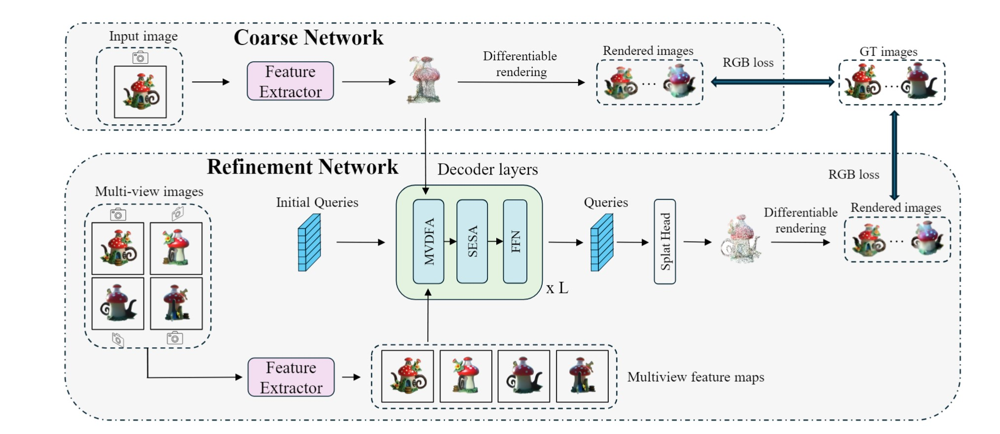

# UniG: Modelling Unitary 3D Gaussians for View-consistent 3D Reconstruction
The code for this project will be available soon. Stay tuned for updates!

[Project Page](https://kenkunliu.github.io/UniG/) | [Arxiv](https://arxiv.org/abs/2404.16323)



Open-category 3D object reconstruction and novel view synthesis from a random number of multi-view images


https://github.com/user-attachments/assets/76d90a4e-a23b-4239-bc58-27ac4d9264b4


## Citation

If you find our work useful in your research, please consider citing:
```bibtex
@article{wu2024unig,
  title={UniG: Modelling Unitary 3D Gaussians for View-consistent 3D Reconstruction},
  author={Wu, Jiamin and Liu, Kenkun and Shi, Yukai and Jiang, Xiaoke and Yao, Yuan and Zhang, Lei},
  journal={arXiv preprint arXiv:2404.16323},
  year={2024}
}
```
Please also check our another project for single image reconstruction [DIG3D](https://github.com/jwubz123/DIG3D). The code will also be released soon.
```bibtex
@article{wu2024dig3d,
  title={DIG3D: Marrying Gaussian Splatting with Deformable Transformer for Single Image 3D Reconstruction},
  author={Wu, Jiamin and Liu, Kenkun and Gao, Han and Jiang, Xiaoke and Zhang, Lei},
  journal={arXiv preprint arXiv:2404.16323},
  year={2024}
}
```

